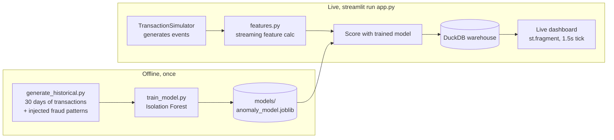

# Real-Time Transaction Fraud Detection

**🔴 [Live demo](https://realtime-fraud-detection-6ug7m6frhzgyqfeefi4pgg.streamlit.app)** — watch it stream and flag transactions in real time.

A live streaming pipeline that generates e-commerce transactions in real
time, scores each one instantly with an unsupervised anomaly-detection
model, and surfaces flagged transactions on a live dashboard as they
happen — end-to-end data engineering (streaming ingestion, feature
pipeline, warehouse) fused with applied ML (unsupervised fraud detection),
rather than a static batch report.

## Why this project

Data-analyst work is mostly batch ETL and reporting. This project deliberately
goes further: it's an event-driven system with sub-2-second latency from
transaction to score to dashboard, built on top of an ML model trained and
evaluated the way a real fraud team would — unsupervised, with the label
only used to check the work afterward, never to fit the model.

## Architecture



## The 3 injected fraud patterns

An unsupervised model needs *something* to isolate. `src/simulate.py`
injects three patterns modeled on real card-fraud signatures, each labeled
with ground truth used **only for evaluation**:

| Pattern | Signature | Real-world analogue |
|---|---|---|
| `amount_spike` | Single purchase 8-20x this customer's own normal spend | Stolen card, high-value test purchase |
| `velocity_burst` | 5-10 transactions from the same customer within ~1-2 min | Card testing / bot checkout abuse |
| `odd_hour_bulk` | Large-quantity purchase at 1-4am | Reseller / bulk-fraud pattern flagged by real fraud teams |

## Feature engineering (`src/features.py`)

Computed incrementally per customer with **Welford's algorithm** (streaming
mean/variance — no rescanning history on every event):

- `amount_zscore` — how far this purchase is from the customer's own normal spend
- `velocity_5min` — transaction count in the last 5 minutes
- `seconds_since_last_txn` — gap since the customer's last purchase, **capped at 1 hour**
- `hour_of_day`, `is_night`, `is_new_customer`

The same feature code runs in both offline training (`generate_historical.py`)
and live scoring (`live_engine.py`) — a common source of real bugs is
training/serving skew where the notebook and the production scorer compute
"the same" feature differently.

### A real bug found and fixed during development

The first version of `seconds_since_last_txn` used an unbounded sentinel
(999999) for customers with no prior transaction. That single extreme value
distorted Isolation Forest's random split selection across the *entire*
feature space — capping it at 3600s (customers who purchase more than once an
hour apart are simply "not rapid succession," the exact value beyond that
doesn't matter) took the model from **F1 0.29 → 0.67** and `velocity_burst`
recall from **8% → 55%**. Both versions are visible in git history if useful
to show interviewers an actual before/after.

A second bug (`velocity_5min` counting timestamps *after* the query time as
"recent" — harmless under normal chronological processing, but a real
correctness gap) was caught by `tests/test_features.py` and fixed before
it could matter.

## Model (`src/train_model.py`)

Isolation Forest, trained unsupervised on 80% of 18,000 historical
transactions, evaluated on the held-out 20% against injected labels:

- **Precision 70.8%** / **Recall 67.1%** / **F1 0.69** / **ROC-AUC 0.936**
- Recall by pattern: `odd_hour_bulk` 100%, `amount_spike` 74%, `velocity_burst` 61%
  (velocity bursts are inherently harder — the first 1-2 transactions in a
  burst are indistinguishable from a normal single purchase until enough
  have accumulated for velocity to spike)

Full report: [`reports/model_evaluation.md`](reports/model_evaluation.md).

## Live dashboard (`app.py`)

Streamlit with `st.fragment(run_every="1.5s")` — only the live section
re-executes on a timer, not the whole page. Each tick:

1. Generates a Poisson-distributed micro-batch of new transactions (the same
   micro-batch pattern Spark Structured Streaming uses internally)
2. Computes features and scores them with the trained model
3. Writes results to a DuckDB warehouse (chosen for fast aggregate queries
   over an append-only fact table without standing up a database server)
4. Renders: live KPIs, a rolling transaction-volume chart, a live alert feed,
   and **live precision/recall** computed against the simulation's known
   ground truth — you can watch detection accuracy converge toward the
   offline evaluation numbers as the stream runs.

## Setup

```bash
pip install -r requirements.txt
```

## Run it

```bash
# 1. Generate 30 days of historical transactions with injected fraud patterns
python src/generate_historical.py

# 2. Train the model and generate the evaluation report
python src/train_model.py

# 3. Launch the live dashboard
streamlit run app.py
```

Steps 1-2 are optional — `app.py` self-bootstraps: if `models/anomaly_model.joblib`
is missing, it runs the generator and trainer automatically on first launch
(everything is seeded, so the result is byte-identical either way). This is
what makes the app deployable straight from source with nothing pre-built.

## Deploying (Streamlit Community Cloud)

The trained model, historical dataset, and warehouse file are intentionally
gitignored — they're build artifacts, not source. A deploy target only needs
the code:

1. Push this repo to GitHub (public, for the free tier).
2. At [share.streamlit.io](https://share.streamlit.io), connect your GitHub
   account and create a new app pointing at this repo, branch `main`, file
   `app.py`.
3. Streamlit Cloud installs `requirements.txt` and runs `streamlit run app.py`.
   On first load the self-bootstrap step generates the data and trains the
   model (a few seconds), then the live stream starts.

## Tests

```bash
pytest tests/ -v
```

14 tests covering feature engineering (streaming stats, velocity windows,
the gap-cap regression) and the event/fraud-pattern generator.

## Project layout

```
src/
  entities.py             customer/product dimension generation
  simulate.py              transaction + fraud-pattern generator
  features.py               streaming feature engineering (CustomerState)
  generate_historical.py    offline: 30-day labeled training dataset
  train_model.py             offline: Isolation Forest + evaluation report
  warehouse.py                DuckDB schema + query helpers
  live_engine.py               live micro-batch generate -> score -> persist
app.py                         Streamlit real-time dashboard
tests/                          pytest suite
data/, models/, reports/, warehouse/   generated artifacts (gitignored)
```

## Interview talking points

- **"Built an event-driven streaming pipeline"** — `live_engine.py`'s
  micro-batch tick loop, not a nightly batch job.
- **"Applied ML coursework to a production-shaped problem"** — unsupervised
  Isolation Forest, proper train/test split, evaluated against known
  ground truth, with a documented feature-engineering iteration that
  measurably improved recall.
- **"Data engineering fundamentals"** — streaming feature computation with
  Welford's algorithm (no full history rescan per event), a warehouse layer
  separate from the scoring logic, tests catching a real correctness bug.
- **"Security-adjacent"** — the three fraud patterns are grounded in actual
  card-fraud signatures (card testing, stolen-card spend spikes, bulk
  reseller fraud), tying in the AI-for-Cybersecurity coursework.

## Natural extensions (if asked "how would you productionize this")

- Replace the in-process simulator with a real message queue (Kafka/Kinesis)
  between producer and consumer.
- Replace DuckDB with a managed warehouse (Redshift/BigQuery/Azure Synapse)
  once multiple consumers need concurrent write access.
- Add a model-drift check comparing live feature distributions against the
  training distribution, alerting if they diverge.
- Replace the synthetic ground truth with a real confirmed-fraud feedback
  loop (chargebacks, manual review outcomes) and retrain periodically.
